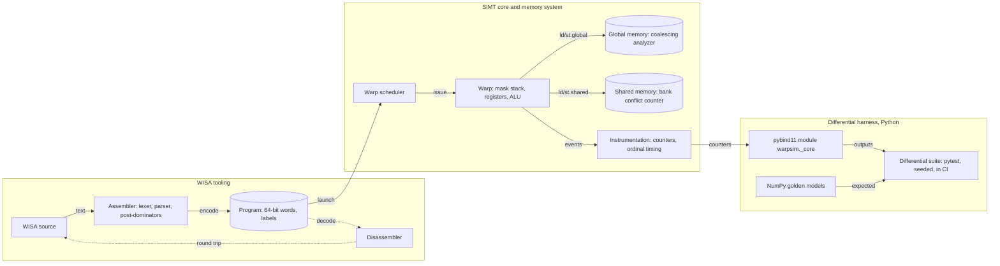

# WarpSim

WarpSim is a functional GPU simulator written in C++20. It executes kernels written in WISA, a small PTX-inspired instruction set, on a software model of a SIMT core: warps of 32 lanes, a warp scheduler, an active-mask divergence stack with reconvergence at assembler-recorded post-dominators, a global memory with a coalescing analyzer, a shared memory with bank-conflict counting, and block barriers. An instrumentation layer collects counters and feeds a coarse timing model. A NumPy differential harness makes correctness a checkable claim rather than an assertion.

Everything runs on the CPU. There is no GPU dependency anywhere in the project.

## Scope statement (binding)

- **Functional first.** The simulator is correct with respect to a NumPy golden model for every shipped kernel, on randomized inputs, in CI. The golden model is authoritative: a disagreement is a simulator bug until a written analysis proves otherwise.
- **Coarse timing, never cycle accuracy.** The timing layer produces ordinal comparisons attributed to observable mechanisms (coalescing, bank conflicts, divergence). It does not model pipelines, caches, DRAM scheduling, or clock domains, and no output of this project may be read as a cycle count.
- **Simulator and tooling only.** No serving layer, no machine learning, no user interface. The Python module exists for the differential harness and for scripting experiments.
- **Single core, single SM.** One streaming multiprocessor is modeled. Grids are executed block by block; blocks are executed warp by warp under a round-robin scheduler. Full-chip modeling is out of scope.

## Architecture

The canonical diagram is `docs/architecture.html`, an interactive standalone page generated from `docs/diagram/architecture.archify.json` (dark theme, JetBrains Mono, a boundary around the differential harness, legend outside all boundaries). The summary below is its GitHub-renderable form and names the same twelve components.



## Components

| Component | Directory | Responsibility |
|-----------|-----------|----------------|
| ISA | `include/warpsim/isa/`, `src/isa/` | Instruction definitions, 64-bit encoding, encode and decode |
| Assembler | `src/asm/` | Text to program: lexer, parser, labels, predicates, post-dominator computation for reconvergence points |
| Disassembler | `src/asm/` | Program to canonical text; round-trips with the assembler |
| Core | `src/core/` | Register file, ALU, predication, divergence stack, warp scheduler, block and grid launch |
| Memory | `src/mem/` | Global memory, shared memory, coalescing analyzer, bank-conflict counter, barrier |
| Instrumentation | `src/instr/` | Counters, divergence statistics, occupancy, coarse timing model |
| Python | `python/` | pybind11 module `warpsim`, golden models, differential tests, report generation |
| Kernels | `kernels/` | The four shipped WISA kernels |
| Docs | `docs/` | ISA specification, architecture diagram, final report |

## The WISA instruction set

The full specification is `docs/wisa-spec.md` and is versioned with the code: any instruction added, removed, or changed updates the specification in the same pull request, and the assembler and disassembler round-trip test covers every instruction listed there. In summary:

- 32 lanes per warp; each lane owns 64 general registers `r0..r63` of 32 bits and 8 predicate registers `p0..p7`.
- Forty-six instructions (version 0.1): integer arithmetic and logic, IEEE single-precision floating point with a fused multiply-add, conversions, twelve `setp` comparisons into predicates, and predicated execution via `@p` and `@!p` prefixes on any instruction.
- Control flow: `bra` carries both its target and an assembler-computed reconvergence point (the immediate post-dominator of the branch). `exit` retires a lane. `bar.sync` synchronizes a block.
- Memory: `ld.global`, `st.global`, `ld.shared`, `st.shared`, and `ld.param` with register plus immediate addressing on 32-bit words.
- Special registers: `%tid.x`, `%tid.y`, `%ntid.x`, `%ntid.y`, `%ctaid.x`, `%ctaid.y`, `%nctaid.x`, `%nctaid.y`, `%laneid`, `%warpid`.
- Fixed 64-bit encoding: opcode, predicate guard, destination, two sources, an immediate flag, and a 32-bit immediate.

## Shipped kernels

| Kernel | File | What it exercises |
|--------|------|-------------------|
| Vector add | `kernels/vecadd.wisa` (float32) and `kernels/vecadd_s32.wisa` (int32) | Baseline coalesced global access, bounds predication |
| Block reduction | `kernels/reduce.wisa` | Shared memory, barriers, a divergent tree that halves the active lanes each step |
| Naive matmul | `kernels/matmul_naive.wisa` | Strided global access on one operand, uncoalesced pattern |
| Tiled matmul | `kernels/matmul_tiled.wisa` | Shared-memory tiles, barriers, coalesced loads, bank-friendly access |

Each kernel has a NumPy golden model in `python/warpsim/golden.py`. Integer kernels must match bit for bit. Float kernels match within a stated tolerance that is recorded in the test and never widened silently.

## Correctness claims and how they are checked

| Claim | Mechanism | Where |
|-------|-----------|-------|
| Every instruction round-trips | Property test: assemble, disassemble, reassemble, compare encodings | `tests/isa/` |
| Divergence is correct | Torture kernels nested to depth 3 with data-dependent branches, randomized inputs, compared to golden | `tests/core/`, `python/tests/` |
| Kernels are correct | Randomized differential suite against NumPy, in CI | `python/tests/test_differential.py` |
| Runs are deterministic | Two runs with the same kernel, inputs, and seed produce identical outputs and identical counters | `python/tests/test_determinism.py` |
| Memory is safe | AddressSanitizer and UndefinedBehaviorSanitizer jobs block merge | `.github/workflows/ci.yml` |
| Timing is ordinal | Tiled matmul ranks above naive matmul and the counters attribute the ranking | `python/tests/test_timing_ordinal.py` |

## Results

The results table is produced by `make bench` from real runs of the built simulator. It is filled in by the final milestone (see `BREAKDOWN.md`, issue M5) and every number in it is reproducible by the commands stated in the pull request that filled it. Columns: kernel, problem size, global segments per warp load, shared bank conflicts, divergent branches, coarse time units, and ranking.

## Building and running

Requirements: a C++20 toolchain (GCC 13 or Clang 17 or newer), CMake 3.25 or newer, Python 3.10 or newer with NumPy. Alternatively, Docker.

```sh
make quickstart      # configure, build, run every test including the differential harness, print the tiled matmul report
make test            # C++ and Python tests
make bench           # naive against tiled matmul, with attribution from the instrumentation
make lint            # clang-format check and clang-tidy
make sanitize        # ASan and UBSan builds and tests
```

CMake presets: `debug`, `release`, `asan`, `ubsan`. Warnings are errors in every preset.

## Engineering standards

- Modern C++20 with clear ownership: values and `std::unique_ptr` where ownership is exclusive, `std::span` and references for views, RAII for every resource, no raw owning pointers.
- clang-format and clang-tidy are enforced in CI. Sanitizer jobs are gates.
- One issue, one branch, one pull request. Conventional commits with why-first bodies. No direct commits to `main`.
- Prose in this repository uses full forms and standard punctuation: no contractions and no em dashes.

## Repository

`github.com/AmosBunde/warp-sim`. Owner: Amos Bunde.
